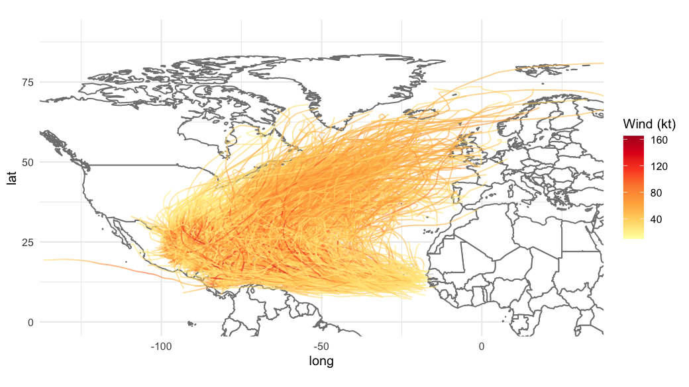
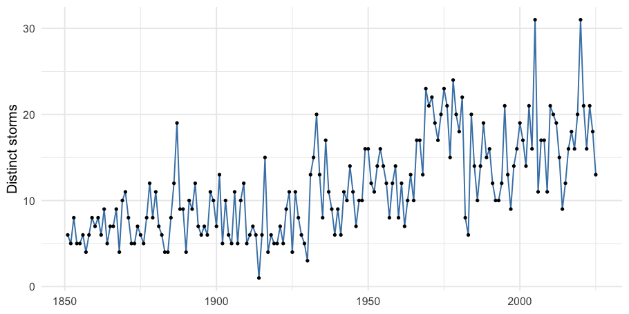
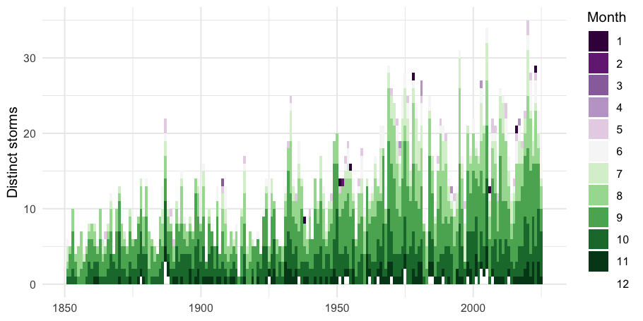

# Atlantic Hurricane Tracks — Visualising HURDAT2 in R

A small data-visualisation project that explores the NOAA **HURDAT2**
Atlantic-basin hurricane dataset (1851–2025, ~2,000 storms, ~56,000 track
points). Originally a 2023 coursework project; refreshed in 2026 with a
proper data pipeline, a few bug fixes, and a clean project layout.

The repo name says "climate data" — the dataset is tropical-cyclone tracks
specifically, which sit at the intersection of meteorology and climate
research. The write-up touches on climate-relevant trends (season widening,
poleward migration of landfall) but does not do formal climate attribution.

## What's here

```
.
├── report/
│   └── hurricane-analysis.Rmd      # main write-up (renders to PDF)
├── R/
│   └── hurricane-analysis.R        # same analysis as a sourced script
├── data/
│   ├── fetch_data.R                # download + tidy NOAA HURDAT2
│   └── README.md                   # data source + column reference
└── output/
    ├── hurricane-analysis.pdf      # rendered report
    └── figures/                    # key charts exported as PNG
```

## Quick start

```bash
# R 4.x with: install.packages(c("maps", "tidyverse", "httr", "stringr", "rmarkdown"))
Rscript data/fetch_data.R                                                  # one-off data download
Rscript -e 'rmarkdown::render("report/hurricane-analysis.Rmd")'
open report/hurricane-analysis.pdf
```

## What the analysis covers

1. **Dataset summaries** — total storms, year span, per-storm track-point
   counts; Katrina 2005 as a worked example.
2. **Spatial visualisation** — a reusable Atlantic basemap, all tracks
   coloured by windspeed, and a single-year view.
3. **Proximity to a reference city** — vectorised great-circle distance from
   each track point to Port-au-Prince; map of every storm that has passed
   within 100 km.
4. **Temporal patterns** — storms per year, landfall zone over time, peak
   windspeed per year, the Atlantic season by month, and a decade-stacked
   view that shows the season widening.

### Headline figures







## Notes on data

The original project loaded a `hurdat2_tidy.RData` file that was never
committed, so the repo was non-runnable. `data/fetch_data.R` now downloads
the latest HURDAT2 release from NOAA directly and reproduces the tidy
format the scripts expect.

## Bug fixes vs. the original draft

| # | Original | Fixed |
|---|----------|-------|
| 1 | `if (y <-90 & y> 90)` silently parsed as `y <- 90; 90 > 90` (dead branch) | `if (any(y < -90 \| y > 90))` |
| 2 | `findD_city` had a dangling `x = Taipei` reference that errored | removed |
| 3 | `install.packages("maps")` mid-script | moved to README install notes |
| 4 | `findD_city_v2` called as scalar inside a vector `mutate` | rewritten to be vectorised |
| 5 | Redundant `library(dplyr)` (already loaded by `tidyverse`) | dropped |
| 6 | `for (i in x){ x <- c(...) }` self-reassigning accumulator in `Hurdat2_summary` | rewritten with `group_by`/`summarise` |
